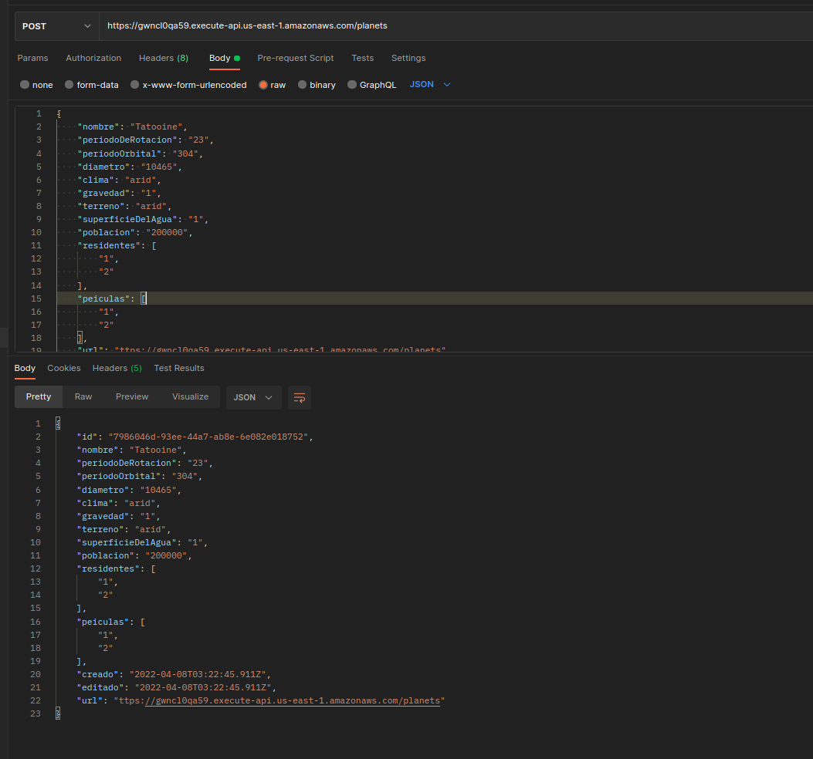
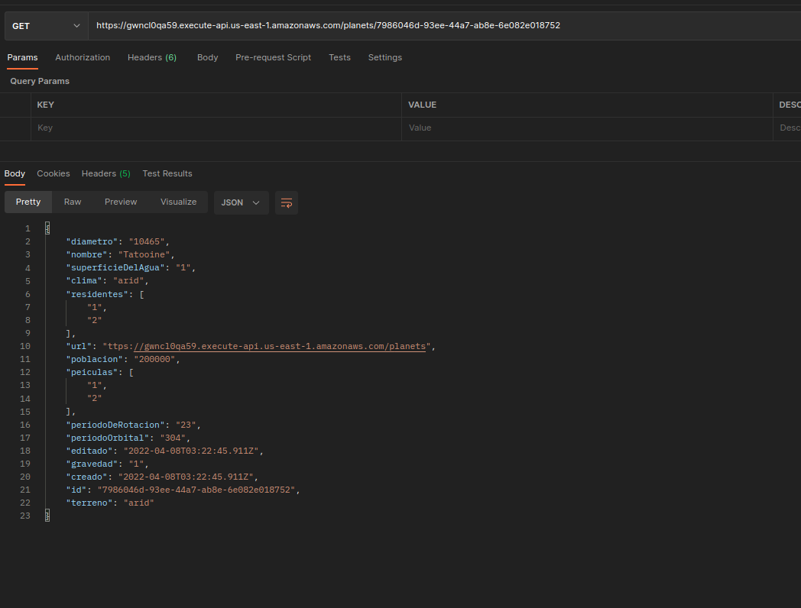
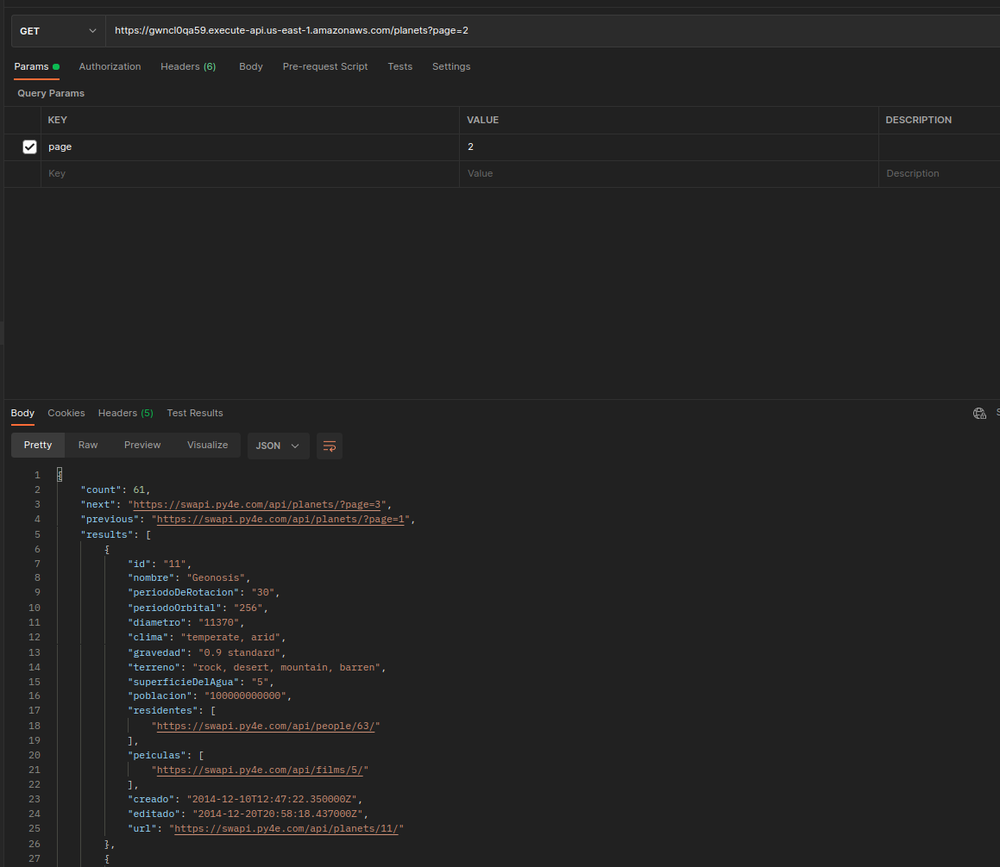
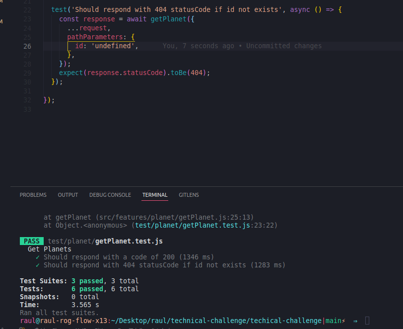

<!--
title: 'AWS Simple HTTP Endpoint example in NodeJS'
description: 'This template demonstrates how to make a simple HTTP API with Node.js running on AWS Lambda and API Gateway using the Serverless Framework.'
layout: Doc
framework: v3
platform: AWS
language: nodeJS
authorLink: 'https://github.com/serverless'
authorName: 'Serverless, inc.'
authorAvatar: 'https://avatars1.githubusercontent.com/u/13742415?s=200&v=4'
-->
# swapi-planets


#### Crear un planeta
Endpoint tipo POST: `https://gwncl0qa59.execute-api.us-east-1.amazonaws.com/planets` 




#### Obtener un planeta
Endpoint tipo GET: `https://gwncl0qa59.execute-api.us-east-1.amazonaws.com/planets/{id}`



#### Obtener varios planetas con paginación
Endpoint tipo GET:`https://gwncl0qa59.execute-api.us-east-1.amazonaws.com/planets`



#### Pasos para poder ejecutar los tests
1. Crear un archivo llamado .env y pegar alli el contenido de env.sample
2. Setear el perfil que configuro en su entorno en la variable AWS_PROFILE del archivo .env      
3. Ejecutar el comando `npm run test`


# Serverless Framework Node HTTP API on AWS

This template demonstrates how to make a simple HTTP API with Node.js running on AWS Lambda and API Gateway using the Serverless Framework.

This template does not include any kind of persistence (database). For more advanced examples, check out the [serverless/examples repository](https://github.com/serverless/examples/) which includes Typescript, Mongo, DynamoDB and other examples.

## Usage

### Deployment

```
$ serverless deploy
```

After deploying, you should see output similar to:

```bash
Deploying aws-node-http-api-project to stage dev (us-east-1)

✔ Service deployed to stack aws-node-http-api-project-dev (152s)

endpoint: GET - https://xxxxxxxxxx.execute-api.us-east-1.amazonaws.com/
functions:
  hello: aws-node-http-api-project-dev-hello (1.9 kB)
```

_Note_: In current form, after deployment, your API is public and can be invoked by anyone. For production deployments, you might want to configure an authorizer. For details on how to do that, refer to [http event docs](https://www.serverless.com/framework/docs/providers/aws/events/apigateway/).

### Invocation

After successful deployment, you can call the created application via HTTP:

```bash
curl https://xxxxxxx.execute-api.us-east-1.amazonaws.com/
```

Which should result in response similar to the following (removed `input` content for brevity):

```json
{
  "message": "Go Serverless v2.0! Your function executed successfully!",
  "input": {
    ...
  }
}
```

### Local development

You can invoke your function locally by using the following command:

```bash
serverless invoke local --function hello
```

Which should result in response similar to the following:

```
{
  "statusCode": 200,
  "body": "{\n  \"message\": \"Go Serverless v3.0! Your function executed successfully!\",\n  \"input\": \"\"\n}"
}
```


Alternatively, it is also possible to emulate API Gateway and Lambda locally by using `serverless-offline` plugin. In order to do that, execute the following command:

```bash
serverless plugin install -n serverless-offline
```

It will add the `serverless-offline` plugin to `devDependencies` in `package.json` file as well as will add it to `plugins` in `serverless.yml`.

After installation, you can start local emulation with:

```
serverless offline
```

To learn more about the capabilities of `serverless-offline`, please refer to its [GitHub repository](https://github.com/dherault/serverless-offline).
